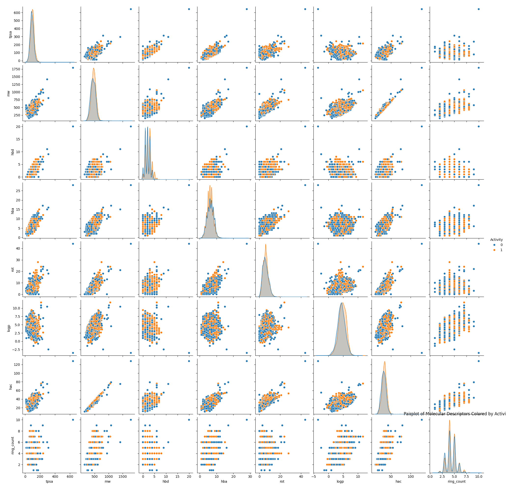

# VEGFR2 Bioactivity Prediction (CHEMBL279)

This project builds machine learning models to predict **bioactivity (Active / Inactive)** of small molecules against **VEGFR2 (CHEMBL279)** using molecular descriptors derived from SMILES.

---

## 📌 Dataset
- Source: **ChEMBL Database**
- Target: **VEGFR2 – Vascular Endothelial Growth Factor Receptor 2**
- Organism: *Homo sapiens*
- Activity Type: IC50 (nM)
- Final Dataset Size: **9,648 unique compounds**

---

## 🧹 Data Processing
- Filtered high-confidence bioactivity data
- Removed duplicate molecules using **InChIKey**
- Averaged bioactivity where multiple measurements existed
- Binary labeling:
  - **Active (1): IC50 < 200 nM**
  - **Inactive (0): IC50 ≥ 200 nM**

---

## 🧪 Molecular Descriptors
Calculated using **RDKit**:
- TPSA  
- Molecular Weight  
- LogP  
- HBD / HBA  
- Rotatable Bonds  
- Ring Count  
- Molecular Fingerprints

---

## 📊 Exploratory Data Analysis

### Activity Class Distribution

### Descriptor Correlation Matrix

### Pairwise Descriptor Relationships

**Key Observations**
- Classes are well balanced
- Strong correlation between MW and Heavy Atom Count
- Active compounds cluster in specific physicochemical ranges

---

## 🤖 Models Trained

### Baseline Models
- Logistic Regression
- Random Forest

### Advanced Models
- XGBoost
- Neural Network (TensorFlow)

---

## 📈 Model Performance (ROC-AUC)
| Model | ROC-AUC | F1 |
|-------|--------|--------|
Logistic Regression | 0.59 | 0.59
Random Forest | 0.73 | 0.73
XGBoost | 0.70 | 0.71
Neural Network | 0.79 | 0.71
---

## 🔍 Feature Importance

### Random Forest
| Feature | Importance |
|--------|------------|
| `mw`     | 0.021836   |
| `logp`   | 0.019279   |
| `tpsa`   | 0.014767   |
| `rot`    | 0.009718   |
| `hba`    | 0.007929   |

---

## 🧠 Key Takeaways
- Physicochemical descriptors can reasonably predict VEGFR2 activity
- Tree-based outperform linear models deep learning models
- Though the `ROC-AUC` was better for deep learning model, but the `f1` score was the best for Random Forest

---

## ⚙️ Tech Stack
- Python, Pandas, NumPy
- RDKit
- Scikit-learn
- XGBoost
- TensorFlow / Keras
- Matplotlib, Seaborn

---

## 📁 Outputs
- Cleaned dataset
- Trained ML models
- EDA and model plots